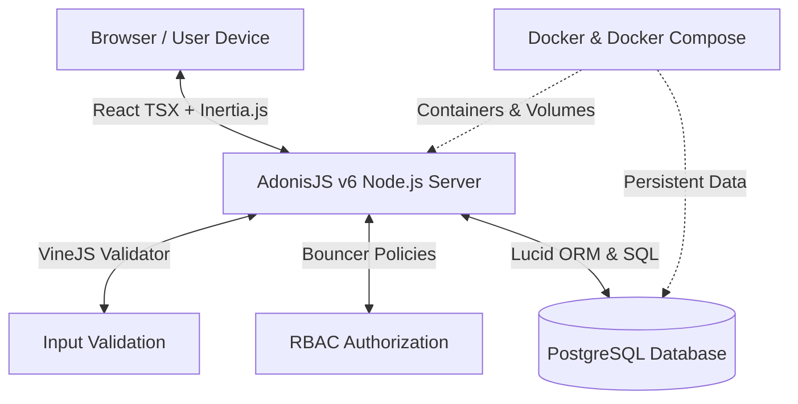

# 🎓 SK Beringis Portal — Developer & Architecture Learning Guide

> **Your Learning Mission:** Master **AdonisJS v6**, **Inertia.js + React (TypeScript)**, **PostgreSQL (Lucid ORM)**, and **Docker** by building a real-world enterprise web application for SK Beringis.

---

## 🗺️ The 4 Core Tech Pillars & How They Fit Together



---

## 🏛️ 1. AdonisJS v6 (The Backend Powerhouse)

### Real-World Concept: MVC & Battery-Included Frameworks
Think of AdonisJS like **Laravel (PHP)** or **Ruby on Rails (Ruby)**, but written in modern TypeScript for Node.js. Unlike barebones frameworks like Express where you must configure everything yourself, AdonisJS gives you structured architecture out of the box:

- **Routing (`start/routes.ts`)**: Defines which URL triggers which controller.
- **Controllers (`app/controllers/`)**: The brains that process requests, query data, and return responses.
- **Lucid ORM (`app/models/`)**: Represents your database tables as TypeScript classes (e.g., `House`, `Event`, `Score`).
- **VineJS (`app/validators/`)**: Super-fast schema validation ensuring marshals only submit valid scores.
- **Bouncer (`app/abilities/` & `app/policies/`)**: Security gatekeepers checking if the user is an **Admin**, **Marshal**, or **Spectator**.

### 💡 Real-World Pattern You Will Learn:
> **Preventing $N+1$ Query Bottlenecks:** Instead of loading 4 houses and making 40 separate queries to count their medals in a loop, you'll learn how to write single, indexed SQL aggregation queries that return live standings in **under 5 milliseconds**.

---

## ⚡ 2. Inertia.js + React TSX (The Modern Monolith)

### Real-World Concept: SPA Feel Without Building Separate APIs
Normally in web development, you have two choices:
1. **Traditional Server-rendered HTML (Blade / Edge / Django templates):** Simple, but full page reloads on every click.
2. **Decoupled REST/GraphQL + React SPA (Vite / Next.js):** Smooth client transitions, but you have to write APIs, manage JWT tokens, handle CORS, and duplicate state.

**Inertia.js is the "Best of Both Worlds":**
- Your AdonisJS controller passes data directly to your React page:
  ```typescript
  return inertia.render('Leaderboard', { houses, liveScores })
  ```
- React receives it as typed props:
  ```tsx
  interface LeaderboardProps {
    houses: HouseDTO[]
    liveScores: ScoreDTO[]
  }
  export default function Leaderboard({ houses, liveScores }: LeaderboardProps) { ... }
  ```
- No client-side routers, no API glue code, zero CORS issues, with blazing-fast React client transitions!

---

## 🛡️ 3. TypeScript (End-to-End Type Safety)

### Real-World Concept: Catching Bugs at Compile Time
In JavaScript, a typo like `score.point` instead of `score.points` causes runtime crashes in production during the sports day event.

With TypeScript:
1. **Lucid Model defines properties:**
   ```typescript
   export default class ParticipantScore extends BaseModel {
     @column()
     declare points: number
   }
   ```
2. **TypeScript flags errors immediately in your IDE** if your React component tries to access a non-existent property or passes a string instead of a number.

---

## 🐳 4. Docker & PostgreSQL (DevOps & Infrastructure)

### Real-World Concept: "It works on my machine" is Dead
Docker packages the entire runtime environment (Node 24, Alpine Linux, PostgreSQL 16, dumb-init supervisor) into container images.

- **`Dockerfile` (Multi-stage build):**
  - **Stage 1 (Build):** Compiles TypeScript, runs Vite asset bundling.
  - **Stage 2 (Runner):** Creates a tiny, secure production image that contains *only* the compiled JavaScript and production dependencies.
- **`docker-compose.yml`:**
  - Coordinates both the application and the PostgreSQL database with persistent storage (`volumes`).
  - Allows you or anyone on your team to start the entire system with one command: `docker compose up -d`.

---

## 🚀 Progressive Learning Roadmap for This Project

| Phase | Milestone | Real-World Skill Acquired |
| :--- | :--- | :--- |
| **Phase 1: Data Modeling** | PostgreSQL schema for Sport Houses, Events, Marshals, and Scores | Database design, foreign keys, migrations |
| **Phase 2: Authentication & RBAC** | Admin login & Marshal PIN/token scoring access | AdonisJS Auth, session cookies, Bouncer policies |
| **Phase 3: Real-Time Scoring** | Field score entry form for marshals with instant validation | VineJS schemas, optimistic UI updates in React |
| **Phase 4: Public Live Portal** | Mobile-responsive spectator leaderboard with auto-refresh | Tailwind CSS, micro-animations, SQL window functions (`RANK() OVER`) |
| **Phase 5: Production Deployment** | Multi-stage Docker image & production environment lockdown | Docker optimization, healthchecks, container orchestration |
